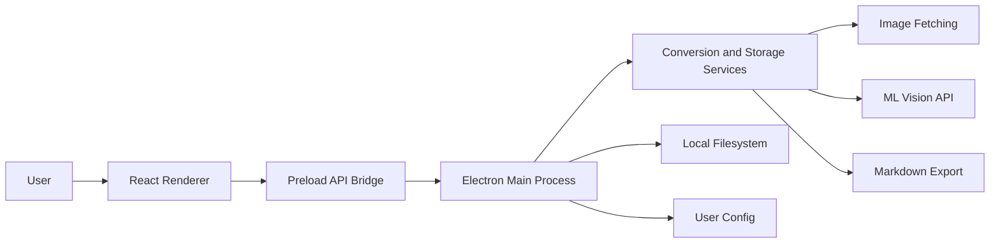

# Diagram Tools


Vibecoded Desktop Electron app that converts public image URLs into editable diagram Markdown. Users can queue JPG, PNG, BMP, or SVG images, send them to an LM Studio, OpenAI-compatible, or Anthropic-compatible vision endpoint, preview the generated diagram code, and save or reopen Markdown files locally.

Primary feature documentation is in [specs/001-image-to-diagram/spec.md](specs/001-image-to-diagram/spec.md), with implementation notes in [plan.md](specs/001-image-to-diagram/plan.md), [quickstart.md](specs/001-image-to-diagram/quickstart.md), and [tasks.md](specs/001-image-to-diagram/tasks.md).

## Technology Stack

- **Runtime**: Node.js 20+ target, Electron desktop shell
- **Language**: TypeScript 5.7 with strict compiler settings
- **Renderer**: React 18, React DOM, Vite 6, Lucide React icons
- **Desktop**: Electron 33 with isolated renderer access through a preload bridge
- **Validation**: Zod for provider config parsing and local validation helpers for image inputs
- **Testing**: Vitest 2, Testing Library, jsdom, coverage via `@vitest/coverage-v8`
- **Quality**: ESLint 9, TypeScript ESLint, React Hooks lint rules, Prettier 3
- **Storage**: Local Markdown files selected through native Electron dialogs; provider settings stored at `~/.image-diagram/config.json`

See [package.json](package.json) for exact dependency versions and scripts.

## Project Architecture

Image to Diagram is a single Electron application split into main, preload, renderer, service, and utility layers.



- The **renderer** provides the queue, provider settings, format selector, progress display, and Markdown preview.
- The **preload bridge** exposes a small `window.imageDiagram` API for config, conversion, Markdown generation, save, and open operations.
- The **main process** owns Electron windows, IPC handlers, file dialogs, filesystem access, and service orchestration.
- The **services layer** fetches images, calls the selected ML API, parses responses, creates Markdown, and reads or writes local files.
- The **utilities layer** centralizes validation, retry behavior, and user-facing error conversion.

## Getting Started

### Prerequisites

- Node.js 20 or newer
- npm
- A reachable vision-capable ML endpoint:
  - LM Studio at the default local chat completions endpoint, or
  - OpenAI-compatible chat completions API, or
  - Anthropic-compatible messages API

### Install

```bash
npm install
```

### Run In Development

```bash
npm run dev
```

The default provider configuration points to LM Studio:

```json
{
  "provider": "lm-studio",
  "endpointUrl": "http://localhost:1234/v1/chat/completions",
  "model": "local-vision-model"
}
```

Provider settings can be edited in the app and are saved to:

```text
~/.image-diagram/config.json
```

### Typical Workflow

1. Start the app with `npm run dev`.
2. Configure provider, endpoint URL, model, and optional API key.
3. Paste a public JPG, PNG, BMP, or SVG URL.
4. Select `mermaid`, `plantuml`, `graphviz`, or `ascii`.
5. Add the URL to the queue and process it.
6. Review or edit the generated Markdown preview.
7. Save, open, or copy the Markdown as needed.

## Project Structure

```text
.
+-- src/
|   +-- main/            # Electron main process and IPC handlers
|   +-- preload/         # Secure renderer-to-main bridge
|   +-- renderer/        # React UI and styles
|   +-- services/        # Config, fetch, ML API, conversion, Markdown, storage
|   +-- types/           # Domain types shared across layers
|   +-- utils/           # Validation, retry, and error helpers
+-- tests/
|   +-- e2e/             # End-to-end workflow specs
|   +-- integration/     # Service integration tests
|   +-- unit/            # Unit tests for validation and Markdown generation
```

## Key Features

- Queue and validate public image URLs before processing
- Support JPG, JPEG, PNG, BMP, and SVG inputs up to 10 MB
- Convert image content to Mermaid, PlantUML, Graphviz, or ASCII diagram code
- Configure LM Studio, OpenAI-compatible, or Anthropic-compatible providers
- Retry transient image and ML API failures with exponential backoff
- Show per-item queue status and progress feedback
- Generate Markdown sections containing source URL, format, timestamp, title, and fenced diagram code
- Preview and edit generated Markdown before saving
- Save Markdown through native dialogs, reopen saved `.md` files, and copy output to the clipboard

## Development Workflow

The implementation plan is organized around a Spec Kit workflow:

1. Define requirements in [spec.md](specs/001-image-to-diagram/spec.md).
2. Capture architecture and technical choices in [plan.md](specs/001-image-to-diagram/plan.md).
3. Break work into dependency-ordered tasks in [tasks.md](specs/001-image-to-diagram/tasks.md).
4. Implement the MVP first: URL validation, queueing, ML conversion, and preview.
5. Add save, open, and copy workflows.
6. Finish with error handling, performance checks, documentation, linting, formatting, type checks, and tests.

The original feature branch documented in the spec is `001-image-to-diagram-converter`; the current local branch is `main`.

## Coding Standards

- Use TypeScript with `strict` mode and no JavaScript source files.
- Keep Electron main-process filesystem and OS access out of the renderer.
- Access main-process functionality from the renderer only through the preload API.
- Avoid `any`; ESLint treats `@typescript-eslint/no-explicit-any` as an error.
- Follow React Hooks rules and keep renderer state updates explicit.
- Format with Prettier: single quotes, semicolons, 100-character print width, and no trailing commas.
- Keep user-facing errors clear by converting lower-level failures through shared error utilities.

Run quality checks with:

```bash
npm run lint
npm run format
npm run typecheck
```

## Testing

Vitest covers unit and integration tests, with e2e workflow specs stored under `tests/e2e`.

Current test focus:

- URL validation, supported media types, and 10 MB image-size guard
- Markdown export structure and fenced diagram output
- ML API response parsing for compatible chat completion responses
- End-to-end workflow coverage for the image-to-diagram path

Run tests with:

```bash
npm test
```

For watch mode:

```bash
npm run test:watch
```

## Contributing

- Start from the spec and task list before changing behavior.
- Keep changes scoped to one workflow or service boundary at a time.
- Add or update tests for validation rules, Markdown output, provider behavior, and user-facing workflows.
- Verify changes with `npm run lint`, `npm run format`, `npm run typecheck`, and `npm test`.
- Use the existing source layout and service boundaries as exemplars: renderer components in `src/renderer`, IPC in `src/main` and `src/preload`, business logic in `src/services`, and shared contracts in `src/types`.

## License

MIT license.
